# VolHelix AI — Technical Innovation & System Uniqueness

> **Document Type**: Hackathon Innovation Manifesto & Institutional Technical Whitepaper  
> **Core Innovation**: Neurosymbolic Multi-Agent Options Trading Swarm with Dual-Mechanism Confluence Gate, 24/7 Decoupled Position Guardian, and Deterministic Zero-Hallucination Risk Gate

---

## ⚡ Executive Quick Answers (Direct Evaluation Guide)

| Evaluation Question | VolHelix AI Answer | System Implementation |
|---|---|---|
| **What is VolHelix AI?** | An autonomous options trading swarm combining multi-agent debate with mathematical risk gates and institutional market microstructure. | `FastAPI`, `Next.js 16.3`, `LangGraph`, `Gemini Flash/Pro`, `Alpaca MCP` |
| **What core problem does it solve?** | Eliminates LLM hallucinatory capital wipeouts, arbitrary retail stop-outs, and abandoned broker positions when auto-pilot is paused. | Neurosymbolic pipeline separating generative thesis synthesis from execution risk. |
| **Why is it "Zero-Hallucination"?** | LLMs **never** execute trades. Even a 100% confident unanimous agent vote is audited against 10 hardcoded mathematical invariants. | `backend/risk/risk_gate.py` (Pure Python, 0 LLM) |
| **What is the 24/7 Position Guardian?** | An independent background daemon that protects open trades and executes dynamic TP/SL **even when Auto-Pilot is turned OFF**. | `backend/engine/auto_trader.py` (5s polling loop) |
| **How are TP & SL calculated?** | Dynamically anchored to institutional liquidity (Order Block floors and FVG / Gamma Wall ceilings), never arbitrary percentages. | `backend/engine/order_flow.py` ($R:R \ge 2.0$) |
| **How does Multi-Agent Debate work?** | Specialized agents (Intel, Synthesizer, Devil's Advocate) debate with deterministic weighted quorum voting. | `backend/agents/consensus.py` (Threshold $\ge 0.33$) |
| **What is the Confluence Gate?** | A pre-LLM filter requiring $\ge 70\%$ alignment across Smart Money Order Blocks, Fair Value Gaps, and Options Gamma (GEX). | `backend/engine/order_flow.py` |

---

## 1. The Fundamental Problem: Why Autonomous LLM Trading Fails

Most LLM-based autonomous trading bots built today fail rapidly in live market conditions due to three architectural flaws:

```
[ Traditional Generative AI Trading Trap ]
LLM Prompt ──> Direct Trade Generation ──> Unconstrained Order Execution ──> Hallucination / Capital Wipeout
```

1. **Hallucinatory Drift & Overconfidence**: Large language models excel at synthesizing qualitative macro narratives, but they struggle with hard mathematical boundary conditions and cannot reliably estimate tail risk under non-stationary market regimes.
2. **Coupled Execution Vulnerability**: In standard bots, when the user halts automated scanning to preserve cash, all active positions are abandoned on the broker without monitoring. If market conditions violently reverse, the trader suffers unhedged drawdowns.
3. **Arbitrary Percentage Stop-Losses**: Retail bots use naive heuristics (e.g. "-2% SL / +4% TP"). Institutional market-makers hunt round-number stops and liquidity clusters, routinely triggering premature liquidations right before the thesis materializes.

### VolHelix AI's Neurosymbolic Solution

```mermaid
flowchart TB
    subgraph MarketIngestion ["1. Market Microstructure Ingestion"]
        A1[Alpaca IEX / SIP Quotes] --> B1[Order Flow Engine]
        A2[Historical 1m/5m/1H Bars] --> B1
        A3[Live Options Chains] --> B2[Gamma Profile Engine]
        B1 --> B3[SMC: Order Blocks & FVG Imbalances]
        B2 --> B4[GEX Put/Call Walls & Net Gamma]
    end

    subgraph Confluence ["2. Institutional Confluence Gate"]
        B3 & B4 --> C1{Composite Score >= 0.70?}
        C1 -->|Score < 0.70| C2[REJECT: Low Edge Standby]
        C1 -->|Score >= 0.70| C3[QUALIFIED: High Confluence Setup]
    end

    subgraph Swarm ["3. Multi-Agent Debate Swarm"]
        C3 --> D1[Market Intel Agent]
        D1 --> D2[Strategy Synthesizer]
        D2 --> D3[Devil's Advocate Agent]
        D2 & D3 --> D4[Deterministic Consensus Engine]
    end

    subgraph RiskGate ["4. Deterministic Zero-LLM Risk Gate"]
        D4 -->|Approved Strategy| E1{10 Hard Mathematical Invariants}
        E1 -->|Delta > 150 or Max Loss > 2.5% NAV| E2[HARD VETO: LLM Hallucination Blocked]
        E1 -->|Passes All 10 Invariants| E3[Signed Execution Order]
    end

    subgraph Execution ["5. Broker Execution & 24/7 Risk Guardian"]
        E3 --> F1[Alpaca Trading Client / MCP Server]
        F1 --> F2[(SQLite Trade Ledger & Realized PnL)]
        F1 --> G1[Active Broker Positions]
        
        subgraph Guardian ["24/7 Position Guardian (Independent Lifecycle)"]
            G1 --> H1{Guardian Loop: Every 5s}
            H1 -->|Spot >= Dynamic TP| H2[Auto-Exit: Take Profit Market Fill]
            H1 -->|Spot <= Dynamic SL| H3[Auto-Exit: Stop Loss Market Fill]
            H1 -->|Auto-Pilot OFF?| H4[New Scans Paused / Existing Trades Protected]
        end
    end

    style RiskGate fill:#1a1d24,stroke:#e02424,stroke-width:2px;
    style Guardian fill:#1a1d24,stroke:#0ecb81,stroke-width:2px;
    style Confluence fill:#1a1d24,stroke:#f0b90b,stroke-width:2px;
```



---

## 2. Innovation 1: Dual-Mechanism Institutional Confluence Gate

Instead of relying on lagging retail technical indicators (RSI, MACD, Moving Average Crossovers), VolHelix AI operates on **institutional market microstructure** by fusing two orthogonal data dimensions before invoking LLM agents:

### A. Smart Money Concepts (SMC) Microstructure
1. **Order Blocks (OB)**:
   - Identifies the footprint of aggressive institutional displacement that breaks market structure.
   - Detected by identifying the final contrary candle before an impulsive sequence with volume $> 1.8\times$ the 20-period moving average.
   - Unmitigated OB levels serve as institutional liquidity demand/supply pools.
2. **Fair Value Gaps (FVG)**:
   - Detects 3-candle price displacement sequences where:
     $$\text{Bullish FVG: } \text{Low}(C_3) > \text{High}(C_1)$$
     $$\text{Bearish FVG: } \text{High}(C_3) < \text{Low}(C_1)$$
   - Identifies liquidity vacuums where price was delivered inefficiently, creating magnets for immediate price rebalancing.

### B. Options Gamma Exposure (GEX) Profile
Options market makers (dealers) continuously delta-hedge. When dealers are net long gamma, they sell rallies and buy dips (dampening volatility). When dealers are net short gamma, they sell drops and buy rips (accelerating volatility).

VolHelix computes aggregate dealer gamma:
$$\text{Net GEX} = \sum_{i} \Gamma_i \times S \times \text{OI}_i \times 100 \times \text{Spot}$$

From this distribution, VolHelix extracts:
- **Call Wall**: The strike price with maximum positive gamma exposure. Represents an institutional volatility resistance ceiling.
- **Put Wall**: The strike price with maximum negative gamma exposure. Represents an institutional volatility support floor.
- **Gamma Flip Point**: The price threshold where market maker hedging transitions from stabilizing to directional acceleration.

### C. The Confluence Scoring Function
Trades are only proposed when the composite confluence score satisfies:
$$\text{Confluence Score} = 0.40 \cdot \mathbf{1}_{\text{OB\_Retest}} + 0.35 \cdot \mathbf{1}_{\text{FVG\_Magnet}} + 0.25 \cdot \mathbf{1}_{\text{GEX\_Wall\_Support}} \ge 0.70$$

If the score is $< 0.70$, the candidate is discarded immediately. This saves LLM token budget and guarantees that trades are only considered at structural turning points.

---

## 3. Innovation 2: 24/7 Autonomous Position Guardian (Decoupled Risk Lifecycle)

A primary risk in production algorithmic trading is the coupling of trade scanning with risk management. Halting a traditional bot to pause new capital allocation also halts risk monitoring on open trades.

**VolHelix AI decouples scanning from risk management into two independent execution threads**:

```mermaid
graph TD
    subgraph Engine ["AutoTrader Core Engine (Thread Decoupling)"]
        UI_Toggle[Auto-Pilot Switch: ON / OFF]
        
        subgraph ScanningLoop ["Thread 1: Watchlist Scanner (_worker_thread)"]
            UI_Toggle -->|User Controlled| ScanLoop{Is Auto-Pilot ON?}
            ScanLoop -->|YES| RunScanner[Scan Watchlist every 30s & Propose New Setups]
            ScanLoop -->|NO| HaltScanner[Scanning Paused: ZERO New Capital Allocated]
        end
        
        subgraph GuardianDaemon ["Thread 2: 24/7 Position Guardian (_guardian_thread)"]
            Boot[FastAPI Lifespan Startup] --> StartGuardian[Start Background Daemon (5s Cycle)]
            StartGuardian --> GuardianLoop[Poll Active Alpaca Broker Positions]
            GuardianLoop --> CheckTP{Spot >= Dynamic TP?}
            CheckTP -->|YES| AutoTP[Cancel Bracket Children & Close at Market]
            GuardianLoop --> CheckSL{Spot <= Dynamic SL?}
            CheckSL -->|YES| AutoSL[Cancel Bracket Children & Close at Market]
            GuardianLoop --> SyncBroker[Sync Fill Data to SQLite Ledger]
        end
    end
    
    style GuardianDaemon fill:#1e2329,stroke:#0ecb81,stroke-width:2px;
    style ScanningLoop fill:#1e2329,stroke:#f0b90b,stroke-width:2px;
```

### Operational Guarantees:
1. **When Auto-Pilot is ON**: The scanning thread evaluates the watchlist every 30 seconds and opens trades that satisfy both the $\ge 70\%$ Confluence Gate and the 10-Invariant Risk Gate.
2. **When Auto-Pilot is OFF**: The scanning thread is instantly suspended. **Zero new trades can be opened**.
3. **The Position Guardian NEVER stops**: Running independently every 5 seconds, it monitors active broker positions. If a position hits its dynamic Take-Profit or Stop-Loss, the Guardian issues immediate market exit orders to Alpaca, cancels resting bracket orders, updates the ACID SQLite ledger (`trades.db`), and broadcasts real-time PnL events via WebSockets.
4. **Targeted Active-Chart Scan Isolation**: When an operator triggers **`Scan & Trade (<Ticker>)`**, the engine isolates analysis strictly to the currently opened asset, preventing unexpected fills on background watchlist symbols.

---

## 4. Innovation 3: Dynamic Structural TP & SL Anchor Engine

Rather than using arbitrary percentage targets (e.g. static -2% / +4%), VolHelix AI dynamically anchors exit targets into **physical market microstructure**:

$$\text{Take-Profit (TP)} = \begin{cases} 
\min(\text{FVG}_{\text{top}}, \text{Call Wall}) & \text{if FVG exists above entry} \\
\text{Call Wall} & \text{if Call Wall} > \text{Entry} \\
\text{Entry} \times 1.040 & \text{fallback structural expansion}
\end{cases}$$

$$\text{Stop-Loss (SL)} = \begin{cases} 
\text{OB}_{\text{low}} \times 0.998 & \text{if Bullish OB exists below entry} \\
\text{Put Wall} \times 0.995 & \text{if Put Wall} < \text{Entry} \\
\text{Entry} \times 0.982 & \text{fallback 1.8\% risk buffer}
\end{cases}$$

### Mathematical Asymmetry:
- **Take-Profit (TP)** is magnetized toward liquidity targets (unbalanced fair value gaps and positive gamma dealer resistance).
- **Stop-Loss (SL)** is tucked behind structural invalidation levels (below institutional accumulation zones).
- This structure enforces an asymmetric **Risk-to-Reward ratio $\ge 2.0:1$** on every executed trade.

---

## 5. Innovation 4: Deterministic Zero-LLM Risk Gate (10 Inviolable Invariants)

The Risk Gate has **ZERO LLM involvement** and cannot be bypassed by prompt injection, agent hallucination, or overconfidence. Even if all agents vote unanimous approval with 1.0 confidence, the candidate order is audited against **10 inviolable mathematical invariants**:

| # | Safety Invariant | Mathematical Constraint | Code Check | Enforcement Action |
|---|---|---|---|---|
| **1** | Max Capital Allocation | $\text{Total Risk} \le 2.5\% \times \text{NAV}$ | `_check_capital_limit()` | **Hard Veto** (Immediate Rejection) |
| **2** | Max Daily Drawdown | $\text{Drawdown}_{\text{daily}} \le 3.0\%$ | `_check_drawdown()` | **Circuit Breaker** (Halt all trading) |
| **3** | Portfolio Delta Limits | $|\Delta_{\text{net}} + \Delta_{\text{proposal}}| \le 0.005 \times \text{NAV}$ | `_check_portfolio_delta()` | **Hard Veto** (Directional risk limit) |
| **4** | Portfolio Vega Limits | $|\nu_{\text{net}}| \le \$500 \text{ per 1\% IV shift}$ | `_check_portfolio_vega()` | **Hard Veto** (Volatility shock limit) |
| **5** | Minimum DTE Window | $\text{DTE} \ge 3 \text{ days}$ | `_check_min_dte()` | **Reject** (Avoids 0-DTE gamma pins) |
| **6** | Spread Strike Width | $\text{Width} \le \$25.00$ | `_check_spread_width()` | **Reject** (Margin efficiency guard) |
| **7** | Max Concurrent Positions | $\text{Open Positions} < 8$ | `_check_simultaneous_positions()` | **Reject** (Over-leverage barrier) |
| **8** | Minimum Open Interest | $\text{OI}_{\text{leg}} \ge 100 \text{ contracts}$ | `_check_liquidity()` | **Reject** (Illiquid slip risk) |
| **9** | Bid-Ask Spread Filter | $\frac{\text{Ask} - \text{Bid}}{\text{Bid}} \le 0.20 \text{ and } \text{Bid} > 0$ | `_check_liquidity()` | **Reject** (Excessive slippage) |
| **10** | Single Asset Exposure | $\text{Exposure}_{\text{asset}} \le 30\% \times \text{NAV}$ | `_check_concentration()` | **Reject** (Idiosyncratic concentration) |

---

## 6. Innovation 5: Multi-Agent Debate Swarm & Deterministic Consensus

VolHelix AI deploys a structured debate protocol rather than a single prompt generator:

1. **Market Intel Agent**: Computes IV Percentile, IV Rank, historical realized volatility, and classifies the macro volatility regime.
2. **Strategy Synthesizer**: Generates Greeks-optimized options spreads (Bull Put Spreads, Bear Call Spreads, Iron Condors, Long Calls).
3. **Devil's Advocate Agent**: Explicitly tasked with finding counter-arguments, liquidity traps, upcoming macro events (FOMC, CPI, Earnings), and bearish divergences.
4. **Event Scanner**: Monitors macro risk schedules in parallel.
5. **Consensus Engine (Deterministic Quorum)**:
   - Aggregates agent votes without LLM interpretation:
     $$\text{Consensus Score} = \frac{\sum_{i} w_i \cdot \text{Multiplier}_i \cdot \text{Confidence}_i}{\sum_{i} w_i}$$
     where $\text{Multiplier} = +1.0$ for `AGREE` and $-1.0$ for `DISAGREE`.
   - Weights: $\text{Synthesizer} = 0.40$, $\text{Devil's Advocate} = 0.30$, $\text{Market Intel} = 0.30$.
   - **Approval Threshold**: Requires $\text{Score} \ge 0.33$ to proceed to the Risk Gate.

---

## 7. Innovation 6: Real-Time Derivatives & 3D Volatility Surface

The `/volatility` lab provides interactive quantitative derivatives modeling directly in the browser:

- **WebGL 3D Implied Volatility Surface**: Real-time manifold plotting **Moneyness vs. DTE vs. Implied Volatility** via Black-Scholes inversion using WebGL and Plotly.
- **Dynamic Strike Ladders**: Automatically centers strike matrices around live spot quotes for `SPY`, `QQQ`, `AAPL`, `NVDA`, and `TSLA`.
- **HMM 5-State Regime Classifier**: A Hidden Markov Model classifying market state into `LOW_VOL`, `NORMAL`, `ELEVATED`, `SQUEEZE`, and `CRISIS`, dynamically tuning position sizes via the Kelly Criterion.
- **Predictive Timeframe Cache**: Candlestick timeframes (`1m`, `5m`, `15m`, `1H`, `4H`, `1D`) are pre-fetched in the background, enabling instantaneous (0ms) chart timeframe switches.
- **Anti-Flash Crash Guard**: A 15% price deviation sanity filter rejects erroneous streaming tick spikes across symbol switches.

---

## 8. Direct Comparative Benchmark

| Architectural Dimension | Naive LLM Trading Bots | Traditional Retail Bots | VolHelix AI Swarm |
|---|---|---|---|
| **Decision Core** | Unconstrained single prompt | Rigid indicators (RSI/MACD) | Adversarial Multi-Agent Debate Swarm |
| **Risk Enforcement** | LLM prompt suggestions (Soft) | Static percentage rules | **Deterministic 10-Invariant Risk Gate** |
| **Guardian Lifecycle** | Pausing stops all monitoring | Stops monitoring on pause | **24/7 Decoupled Position Guardian** |
| **Market Microstructure** | None (Raw prices) | Lagging price averages | **SMC Order Blocks + FVG + Gamma Walls (GEX)** |
| **Target Calibration** | Arbitrary percentages | Fixed bracket offsets | **Structural Liquidity Anchors ($R:R \ge 2:1$)** |
| **Broker Protocol** | Simple REST webhooks | Simple REST webhooks | **Alpaca Trading API + Model Context Protocol (MCP)** |
| **Volatility Analytics** | None | Simple 20-day historical vol | **3D WebGL Black-Scholes Surface + HMM Regimes** |
| **State Persistence** | In-memory only (Lost on crash) | Local config files | **ACID SQLite Ledger + Live Alpaca Sync** |
| **Test Verification** | Little to none | Basic unit tests | **47 / 47 Automated Test Suite Passing** |

---

## 9. Conclusion

VolHelix AI proves that autonomous AI trading does not require choosing between generative intelligence and capital safety. By using large language models exclusively for **thesis discovery and adversarial debate**, while enforcing **institutional market microstructure** on the front-end and **deterministic mathematical invariants** on the back-end, VolHelix AI establishes a zero-hallucination standard for autonomous options trading.
