# VolHelix AI — Technical Innovation & Architectural Edge

> **Platform:** VolHelix AI Autonomous Crypto Volatility Platform  
> **Core Edge:** Neurosymbolic Multi-Agent Crypto Swarm • Deterministic Zero-LLM Risk Gate • 24/7 Decoupled Position Guardian  
> **Status:** 84/84 Automated Tests Passing • Dual-Mode Binance Architecture • Production Ready

---

## 60-Second Summary 

| Question | The VolHelix AI Answer | Architectural Implementation |
|---|---|---|
| **What is VolHelix AI?** | An autonomous crypto trading swarm combining multi-agent adversarial debate with institutional microstructure and zero-hallucination mathematical risk gates. | `FastAPI`, `Next.js 16.3`, `LangGraph`, `Gemini 2.5 Flash/Pro`, `python-binance` |
| **What fundamental problem does it solve?** | Eliminates LLM hallucinatory capital blowups, arbitrary retail stop-outs, and abandoned broker positions when auto-pilot is paused. | Neurosymbolic pipeline separating generative thesis synthesis from deterministic execution. |
| **Why is it "Zero-Hallucination"?** | LLMs **never** touch execution or risk limits. Even a 100% confident unanimous agent vote is audited against 10 hardcoded mathematical invariants. | `backend/risk/risk_gate.py` (Pure Python, 0 LLM) |
| **What is the 24/7 Position Guardian?** | An independent background daemon that protects open trades and executes dynamic TP/SL **even when Auto-Pilot scanning is turned OFF**. | `backend/engine/auto_trader.py` (Independent 5s polling thread) |
| **How are TP & SL calculated?** | Dynamically anchored to institutional liquidity (Order Block floors and FVG imbalance ceilings), never arbitrary percentages. | `backend/engine/order_flow.py` ($R:R \ge 2.0:1$) |
| **How does it achieve high responsiveness?** | Thread-pool concurrency, in-memory TTL caching (6.2ms), and decoupled React component memoization. | Backend TTL Cache + Frontend Memoized Canvas |

---

## 🏛️ End-to-End System Architecture

```mermaid
flowchart TB
    subgraph Ingestion ["1. Institutional Microstructure Engine"]
        A1[Binance Production Quotes] --> B1[Order Flow Engine]
        A2[Production Klines 1m/5m/1H] --> B1
        A3[Order Book Depth 20-Level] --> B2[Liquidity & Imbalance Engine]
        B1 --> B3[SMC: Order Blocks & FVG Imbalance]
        B2 --> B4[Order Book Bid/Ask Imbalance & Spread]
    end

    subgraph Confluence ["2. Institutional Confluence Gate"]
        B3 & B4 --> C1{Composite Score >= 70%?}
        C1 -->|Score < 0.70| C2[DISCARD: Low Edge Standby]
        C1 -->|Score >= 0.70| C3[QUALIFIED: High-Edge Structural Setup]
    end

    subgraph Swarm ["3. Adversarial Multi-Agent Debate Swarm"]
        C3 --> D1[Market Intel Agent]
        D1 --> D2[Strategy Synthesizer]
        D2 --> D3[Devil's Advocate Agent]
        D2 & D3 --> D4[Deterministic Consensus Engine: 2/3 Weighted Quorum]
    end

    subgraph RiskGate ["4. Deterministic Zero-LLM Crypto Risk Gate"]
        D4 -->|Approved Strategy| E1{10 Hard Mathematical Invariants}
        E1 -->|Violation: Loss > 2.5% NAV or DD > 3%| E2[HARD VETO: LLM Hallucination Blocked]
        E1 -->|Passes All 10 Invariants| E3[Signed Execution Order]
    end

    subgraph Execution ["5. Binance Execution & 24/7 Decoupled Guardian"]
        E3 --> F1[Binance Testnet Client]
        F1 --> F2[(SQLite Trade Ledger & Realized PnL)]
        F1 --> G1[Active Binance Spot Holdings]
        
        subgraph Guardian ["24/7 Position Guardian (Independent Lifecycle)"]
            G1 --> H1{Guardian Loop: Every 5s}
            H1 -->|Spot >= Dynamic TP| H2[Auto-Exit: Take Profit Market Fill]
            H1 -->|Spot <= Dynamic SL| H3[Auto-Exit: Stop Loss Market Fill]
            H1 -->|Auto-Pilot OFF?| H4[New Scans Paused • Open Trades Protected]
        end
    end

    style RiskGate fill:#1a1d24,stroke:#e02424,stroke-width:2px;
    style Guardian fill:#1a1d24,stroke:#0ecb81,stroke-width:2px;
    style Confluence fill:#1a1d24,stroke:#f0b90b,stroke-width:2px;
```



---

## 🎯 The 6 Core Breakthroughs

### 1. High-Frequency Order Flow Engine & Tick-Level Microstructure
VolHelix AI doesn't just read lagging candlestick data. It ingests sub-second `aggTrade` and `depth@100ms` diff-depth streams directly from Binance.
- **Footprint Charting**: Constructs true price-bucketed buy/sell volume per bar, calculating Delta and Cumulative Volume Delta (CVD) in real-time.
- **Institutional Confluence Gating**: The Order Flow Engine searches for diagonal imbalances, stacked imbalances (institutional absorption), and liquidity walls (resting orders $\ge 5\times$ median size).
- **Absolute Stale Data Veto**: A hard-veto forces the agent to discard any signal if the WebSocket connection drops or lags.

### 2. Dual-Mode Binance Architecture
- **Production Data Ingestion**: Live spot prices, 24hr statistics, 20-level order book depth, and klines are streamed from `api.binance.com`.
- **Spot Testnet Paper Execution**: Orders, balances, and cancellations operate on `testnet.binance.vision` with zero real capital risk.
- **Clock Drift Offset Sync**: Calculates system offset against Binance server time and automatically offsets timestamps to eliminate `-1021 INVALID_TIMESTAMP` errors.

### 3. Deterministic Zero-LLM Crypto Risk Gate (10 Hard Invariants)
LLMs are completely prohibited from risk and execution decisions. All trade proposals must pass **10 hardcoded mathematical checks**:

```
[ Trade Proposal ] ──> [ 10-Invariant Risk Gate ] ──> [ Binance Execution ]
                             │
            Any Rule Fails? ─┴─> HARD VETO (Zero Hallucination)
```

1. **Max Capital at Risk**: $\le 2.5\%$ of account NAV per trade ($250.00 max loss on $10,000 USDT starting capital).
2. **Stop-Loss Requirement**: Strictly positive stop-loss required on all trades.
3. **Take-Profit Requirement**: Strictly positive take-profit required on all trades.
4. **Portfolio Daily Drawdown**: Circuit breaker halts trading if daily drawdown reaches $3.0\%$.
5. **Portfolio Exposure Limit**: Aggregate non-USDT exposure $\le 60.0\%$ NAV.
6. **Single Asset Concentration**: Exposure strictly $\le 30\%$ of total NAV.
7. **Max Open Positions**: Capped at $5$ simultaneous positions.
8. **Minimum Order Size**: Order notional strictly $\ge \$10.00$ USDT (Binance spot minimum).
9. **Volatility Sizing Multiplier**: Dynamic scaling by market regime ($1.00\times$ in Normal, $0.75\times$ in Elevated, $0.50\times$ in Squeeze, $0.25\times$ in Crisis).
10. **Correlation Group Limits**: Sector risk gating across correlated clusters.

### 4. 24/7 Decoupled Position Guardian
In standard trading bots, pausing automated scanning abandons open positions. VolHelix AI **decouples scanning from risk management into two independent execution threads**:

```mermaid
graph LR
    subgraph ScannerThread ["Thread 1: Auto-Pilot Scanner"]
        Toggle[Auto-Pilot Switch] -->|OFF| Pause[Scanning Suspended • 0 New Capital]
        Toggle -->|ON| Scan[Scan Watchlist every 30s]
    end

    subgraph GuardianThread ["Thread 2: 24/7 Position Guardian"]
        Daemon[5s Background Loop] --> Monitor[Poll Broker Positions]
        Monitor --> Condition{Spot >= TP or Spot <= SL?}
        Condition -->|YES| Exit[Execute Immediate Market Fill]
        Condition -->|NO| Sleep[Continue 24/7 Protection]
    end

    style GuardianThread fill:#1e2329,stroke:#0ecb81,stroke-width:2px;
    style ScannerThread fill:#1e2329,stroke:#f0b90b,stroke-width:2px;
```



- **Safety Guarantee**: Even when Auto-Pilot is turned **OFF**, the Position Guardian continues running every 5 seconds, enforcing dynamic TP/SL exits and logging fills to the SQLite ACID ledger.

### 5. Structural Liquidity TP/SL Anchors ($R:R \ge 2.0:1$)
VolHelix AI eliminates arbitrary percentage targets (e.g. "-2% SL / +4% TP") that get hunted by market makers:
- **Take-Profit (TP)**: Magnetized to the Fair Value Gap top or resistance liquidity ceiling.
- **Stop-Loss (SL)**: Protected behind the Order Block invalidation floor.
- **Asymmetric Payoff**: Enforces a minimum **Risk-to-Reward ratio $\ge 2.0:1$** on every executed trade.

### 6. High-Frequency Speed & 24/7 Timezone Synchronization
- **Sub-10ms In-Memory TTL Caching**: Market quotes and klines are cached with a 5s–20s TTL, slashing scan times from 7.3s down to 6.2ms.
- **Zero-Lag Terminal UI**: Decoupled memoization (`OrderBookWidget`, `CandlestickChart`, `VolumeBarChart`) prevents canvas redraws on streaming price ticks.
- **Indian Standard Time (IST, UTC+5:30) Engine**: Chart bars, time axis, and tooltip badges are automatically converted to IST, paired with dual live clocks (**IST Local** and **UTC Market**) in the header.

---

## 📊 Direct Comparative Benchmark

| Capability | Naive LLM Bots | Traditional Retail Bots | VolHelix AI Swarm |
|---|---|---|---|
| **Architecture** | Single unconstrained prompt | Rigid static indicators | **Adversarial Multi-Agent Debate Swarm** |
| **Risk Enforcement** | Soft prompt suggestions | Naive fixed stop percentages | **10 Deterministic Invariants (0 LLM)** |
| **Position Safety** | Pausing stops all monitoring | Pausing abandons open trades | **24/7 Decoupled Position Guardian** |
| **Market Intelligence** | Raw price history | Lagging moving averages | **SMC Order Blocks + FVG + 20-Level Depth** |
| **Target Calibration** | Arbitrary percentages | Static point brackets | **Structural Liquidity Anchors ($R:R \ge 2:1$)** |
| **Broker Integration** | Simple webhook mocks | Basic REST wrappers | **Dual-Mode Binance Client (Production Data + Testnet)** |
| **Order Lifecycle** | Incomplete mock states | Basic order log | **Market $\to$ Positions, Limit $\to$ Pending $\to$ History** |
| **Timezone Support** | Server UTC only | Local device only | **Dual Clocks (IST UTC+5:30 & UTC) + Continuous 24/7** |
| **Test Coverage** | None / Untested | Minimal unit tests | **84 / 84 Automated Tests Passing (100%)** |

---

## 🔬 Rigorous Verification & Metrics

- **Automated Test Suite**: 84 passed (`pytest backend/tests/ -v`).
- **Production Build**: Next.js 16.3 compiled with 0 errors and 0 warnings (`npm run build`).
- **Scan Latency**: Multi-ticker parallelized scan executes across all 5 symbols in $< 2.5\text{s}$ (cached: $6.2\text{ms}$).
- **Ledger Reliability**: ACID SQLite persistence (`trades.db`) synchronizing real-time realized P&L, Win Rate %, and Profit Factor.
