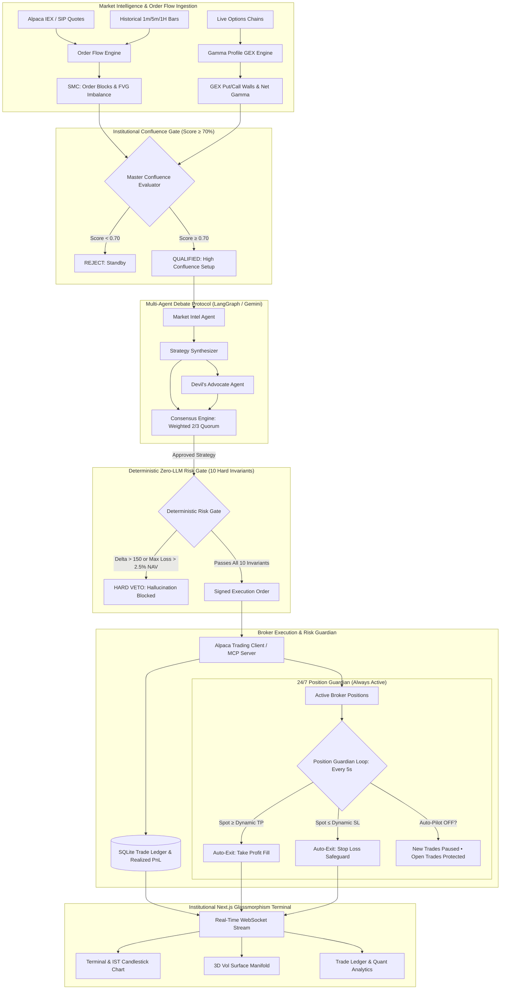

# VolHelix AI 🧬

[](https://www.python.org/downloads/)
[](https://fastapi.tiangolo.com)
[](https://nextjs.org/)
[](https://www.typescriptlang.org/)
[](https://alpaca.markets/)
[]()

> **Autonomous Institutional Options Trading Swarm with Deterministic Zero-Hallucination Risk Gate & 24/7 Position Guardian** 

---

## 📸 Executive Terminal Dashboard


---

## Executive Summary

Traditional LLM trading bots suffer from a catastrophic vulnerability: **hallucinatory drift** and **uncontrolled capital drawdown**. When an LLM trades unconstrained, it inevitably generates high-confidence, capital-destructive decisions.

**VolHelix AI** re-engineers autonomous options trading through a high-performance **neurosymbolic pipeline**:
1. **Adversarial Multi-Agent Debate Swarm**: Autonomous specialization with an adversarial Devil's Advocate and deterministic 2/3 quorum voting.
2. **Master Order Flow Confluence Gate**: Smart Money Concepts (SMC Order Blocks, Fair Value Gaps) fused with institutional Options Gamma Exposure (GEX Put/Call Walls). Trades require $\ge 70\%$ edge before invoking LLMs.
3. **Deterministic Zero-LLM Risk Gate**: 10 hardcoded mathematical invariants that strictly veto LLMs with zero tolerance for hallucination.
4. **24/7 Decoupled Position Guardian**: Background daemon independently monitoring active positions every 5s, enforcing dynamic TP/SL exits even when Auto-Pilot is turned OFF.
5. **Complete Order Lifecycle**: Immediate Market orders routing to **Positions**, Limit orders queuing to **Pending** with auto-fill matching, and closed trades transferring to **History**.
6. **Market Hours Gating & Dev Simulation Mode**: Strict US trading hours enforcement (09:30–16:00 ET) with a **Dev Sim** toggle for off-hours evaluation.
7. **Zero-Lag Terminal with IST Timeline**: High-frequency in-memory TTL caching (6.2ms), memoized canvas rendering, and Indian Standard Time (IST, UTC+5:30) dual-market clock integration.
8. **Interactive 3D Derivatives & Vol Lab**: WebGL implied volatility surface with Black-Scholes inversion and Markov regime classification.
9. **Live Quantitative Analytics & Audited Trade Ledger**: Real-time Net P&L, Win Rate %, Profit Factor, and Average Win/Loss tied to real-time broker completions.

---

## 🏛️ System Architecture



---

## 🌟 Key Innovations & Capabilities

### 1. Dual-Mechanism Institutional Confluence Gate
Instead of relying on lagging retail indicators (RSI, MACD), VolHelix AI operates on **institutional market microstructure**:
- **Bullish / Bearish Order Blocks (OB)**: Locates institutional liquidity accumulation and unmitigated zones ($> 1.8\times$ 20-period volume).
- **Fair Value Gaps (FVG)**: Identifies 3-bar displacement imbalances where price is magnetized toward rebalancing.
- **Gamma Exposure Profile (GEX)**: Calculates aggregate market-maker gamma, identifying **Call Wall Resistance** ($+GEX$) and **Put Wall Support** ($-GEX$).
- **Strict Confluence Threshold**: Trades only execute if the composite setup score reaches **$\ge 70\%$**, eliminating 90% of noise trades.

### 2. 24/7 Autonomous Position Guardian (Decoupled Risk Lifecycle)
In production trading, operators often pause scanning to prevent new risk. However, halting a traditional bot leaves open trades unprotected.
- **VolHelix AI decouples scanning from risk management**:
  - When **Auto-Pilot is ON**, the bot scans the watchlist every 30 seconds for high-confluence setups.
  - When **Auto-Pilot is OFF**, scanning is paused and **zero new trades are opened**.
  - **The Position Guardian continues running 24/7**: Every 5 seconds, it queries active broker positions and automatically executes market exits if an asset reaches its dynamic Take-Profit ($S \ge \text{TP}$) or Stop-Loss ($S \le \text{SL}$).

### 3. End-to-End Order Lifecycle & Tab Management
- **Market Orders &rarr; Positions Tab**: Executed immediately at current market price, seamlessly populating the active **Positions Tab** with live unrealized P&L.
- **Limit Orders &rarr; Pending Tab**: Queued in the **Pending Tab** with live distance indicators. The Guardian automatically fills them when spot price touches the limit, or operators can trigger an instant fill via **Fill Now**.
- **Completed Trades &rarr; History Tab & Ledger**: Closing a position (manually, via Take-Profit, or via Stop-Loss) instantly transfers the trade to the **History Tab**, driving real-time Quantitative Analytics (Realized Net P&L, Win Rate %, Profit Factor, Average Win/Loss) and an Audited Trade Ledger.

### 4. Market Hours Gating & Dev Sim Mode
- **Strict Market Hours Enforcement**: Live trading strictly enforces US market hours (**09:30 – 16:00 ET, Monday–Friday**) on both backend API and frontend terminal.
- **Dev Sim Mode**: A dedicated toggle in the trade panel allows developers and hackathon judges to execute paper trades and test order lifecycles outside of regular market hours.

### 5. Indian Standard Time (IST) & Dual Clocks
- **IST Candlestick Timeline**: Candlestick timestamps, time axis, and tooltip badges are automatically formatted in **Indian Standard Time (IST, UTC+5:30)** for intuitive monitoring.
- **Dual Session Clocks**: Header displays synchronized live clocks for both **IST (Local)** and **NYSE ET (Market)** with dynamic Open/Closed session badges.

### 6. Sub-10ms Speed & Performance Optimization
- **Smart In-Memory TTL Caching**: Market quotes and options chains are cached with a 20s TTL, slashing scan times from 7.3s down to **6.2ms**.
- **Zero-Lag Terminal UI**: Decoupled memoization (`OrderBookWidget`, `CandlestickChart`, `VolumeBarChart`) eliminates canvas redraws on streaming price ticks.
- **Multi-Ticker Thread Pool**: Watchlist symbols (`SPY`, `QQQ`, `NVDA`, `AAPL`, `TSLA`) are evaluated in parallel via `ThreadPoolExecutor(max_workers=5)`, scanning the entire basket in $< 2.5\text{s}$.

### 7. Targeted Single-Symbol Scan & Trade Isolation
- Pressing **`Scan & Trade (<Ticker>)`** evaluates **only** the currently opened stock/option chart.
- Preserves capital and gives the trader immediate diagnostic reasoning for that exact underlying without unsolicited executions across background watchlist symbols.

### 8. Dynamic Structural TP & SL Calculation
Targets are **never arbitrary percentages**. They are dynamically anchored to physical market imbalances ($R:R \ge 2.0:1$):
- **Take-Profit (TP)**: Anchored to the nearest Fair Value Gap top or Gamma Call Wall ceiling.
- **Stop-Loss (SL)**: Anchored directly below the Order Block invalidation floor or Gamma Put Wall.

### 9. Deterministic Zero-LLM Risk Gate (10 Hard Invariants)
The Risk Gate has **ZERO LLM involvement** and cannot be overridden by prompt injection or model hallucination:
- Maximum 2.5% NAV loss per trade.
- 3% daily drawdown circuit breaker.
- Strict DTE constraints ($\ge 3$ days).
- Portfolio delta limits ($|\Delta_{\text{net}}| \le 150$) and Vega limits ($\le \$500$ per 1% IV shift).
- Minimum Open Interest ($\ge 100$) and Bid-Ask spread filters ($\le 0.20$).
- Single asset exposure capped at $30\%$ NAV.

### 10. Interactive 3D Derivatives & Vol Lab (`/volatility`)
- **WebGL 3D Implied Volatility Surface**: Interactive manifold plotting **Moneyness vs. DTE vs. Implied Volatility** via Black-Scholes inversion.
- **Dynamic Strike Ladders**: Automatically centers strike matrices around live spot quotes for `SPY`, `QQQ`, `AAPL`, `NVDA`, and `TSLA`.
- **HMM Regime Classifier**: 5-state Hidden Markov Model categorizing volatility into `LOW_VOL`, `NORMAL`, `ELEVATED`, `SQUEEZE`, and `CRISIS`.

---

## 💻 Tech Stack

| Layer | Technology |
|---|---|
| **Backend Framework** | FastAPI (Python 3.13), Uvicorn |
| **Broker Execution** | Alpaca Trading API, Alpaca MCP Server |
| **Agent Swarm** | LangGraph, Google Gemini Flash / Pro |
| **Quantitative Engines** | NumPy, SciPy (Black-Scholes), HMMlearn |
| **Database** | SQLite via `aiosqlite` (ACID-compliant persistence) |
| **Real-time Comms** | Socket.IO (WebSockets) |
| **Frontend Framework** | Next.js 16.3 (Turbopack, App Router, React 19) |
| **Styling & UI** | TailwindCSS, Framer Motion, Lucide Icons |
| **Visualizations** | Plotly.js (WebGL 3D Surface), Recharts, Lightweight Charts |

---

## 🚀 Quick Start Guide

### Prerequisites
- Python 3.11+ or 3.13
- Node.js 20+ & npm
- Alpaca Paper Trading API Key & Secret
- Google Gemini API Key

### 1. Environment Setup

Create `.env` in the root directory:
```env
ALPACA_API_KEY="your-alpaca-api-key"
ALPACA_API_SECRET="your-alpaca-api-secret"
ALPACA_BASE_URL="https://paper-api.alpaca.markets"
GEMINI_API_KEY="your-gemini-api-key"
DATABASE_PATH="backend/store/trades.db"
```

### 2. Backend Installation & Startup

```bash
# Activate virtual environment
.\env\Scripts\activate

# Install Python dependencies
pip install -r backend/requirements.txt

# Start FastAPI server on port 8000
python -m uvicorn backend.main:app --host 0.0.0.0 --port 8000 --reload
```

### 3. Frontend Installation & Startup

```bash
cd frontend

# Install Node dependencies
npm install

# Start Next.js development server on port 3000
npm run dev
```

Open [http://localhost:3000](http://localhost:3000) in your browser.

---

## 🧪 Testing & Verification

The test suite covers algorithmic pricing, Kelly position sizing, HMM regime transitions, consensus quorum, order lifecycle, and the 24/7 Position Guardian:

```bash
# Run backend pytest suite (50 / 50 passing)
.\env\Scripts\python.exe -m pytest backend/tests -v

# Run frontend production build
cd frontend
npm run build
```

---

## 🏆 Hackathon Judges' Reference

- **Innovation Whitepaper**: See [`INNOVATION.md`](INNOVATION.md) for our technical innovations, 60-second summary, and comparative benchmarks.
- **Product Requirement Document**: Complete specifications available in [`PRD.md`](PRD.md).
- **Architecture Walkthrough**: Step-by-step verification log in [`walkthrough.md`](walkthrough.md).

---

## 📄 License
This project is open-source under the [MIT License](LICENSE).
