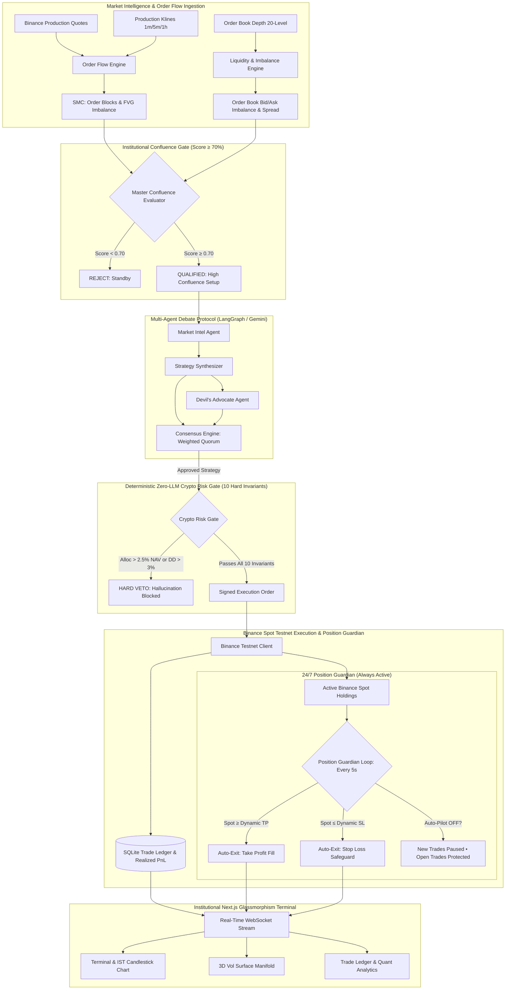

# VolHelix AI 🧬

[](https://www.python.org/downloads/)
[](https://fastapi.tiangolo.com)
[](https://nextjs.org/)
[](https://www.typescriptlang.org/)
[](https://testnet.binance.vision/)
[]()

> **Autonomous Multi-Agent Crypto Spot Volatility Trading Swarm with Dual-Mode Binance Architecture, Deterministic Zero-Hallucination Risk Gate & 24/7 Position Guardian** 

---

## 📸 Executive Terminal Dashboard


---

## Executive Summary

Traditional LLM trading bots suffer from a catastrophic vulnerability: **hallucinatory drift** and **uncontrolled capital drawdown**. When an LLM trades unconstrained, it inevitably generates high-confidence, capital-destructive decisions.

**VolHelix AI** re-engineers autonomous crypto volatility trading through a high-performance **neurosymbolic pipeline**:
1. **Dual-Mode Binance Architecture**: Real-time production market data (prices, klines, order books from `api.binance.com`) paired with Binance Spot Testnet (`testnet.binance.vision`) paper trading with automatic clock drift compensation.
2. **Adversarial Multi-Agent Debate Swarm**: Autonomous specialization (MarketIntel, StrategySynthesizer, RiskGate, Devil's Advocate) with deterministic quorum voting.
3. **Master Order Flow Confluence Gate**: Smart Money Concepts (SMC Order Blocks, Fair Value Gaps, Liquidity Heatmaps) fused with Parkinson Realized Volatility. Trades require $\ge 70\%$ edge before execution.
4. **Deterministic Zero-LLM Crypto Risk Gate**: 10 hardcoded mathematical invariants enforcing capital caps, 3% daily drawdown limits, strictly positive TP/SL, and asset concentration safeguards with zero tolerance for LLM hallucination.
5. **24/7 Decoupled Position Guardian**: Background daemon independently monitoring active crypto positions every 5s, enforcing dynamic TP/SL exits even when Auto-Pilot scanning is paused.
6. **Complete Spot Order Lifecycle**: Market orders route to **Positions**, Limit orders queue to **Pending** with auto-fill matching, and closed trades transfer to **History**.
7. **Continuous 24/7 Session & Dual Clocks**: 365-day continuous crypto market operation with live synchronized **IST (Local, UTC+5:30)** and **UTC** clocks.
8. **Interactive 3D Derivatives & Vol Lab**: WebGL volatility surface with 365-day Parkinson realized volatility, Bollinger Band compression squeeze detection, and Markov regime classification.
9. **Live Quantitative Analytics & Audited Trade Ledger**: Real-time Net P&L, Win Rate %, Profit Factor, and Average Win/Loss tied to real-time broker completions.

---

## 🏛️ System Architecture



---

## 🌟 Key Innovations & Capabilities

### 1. Dual-Mode Binance Architecture
- **Market Data from Production**: Live spot prices, 24hr tickers, 20-level order book depth, and OHLCV klines are fetched directly from production `api.binance.com` without API key rate limits.
- **Trading on Spot Testnet**: Account balance, spot order placement, cancellations, and position management operate on `testnet.binance.vision` using virtual funds (10,000 USDT base capital).
- **Automatic Clock Drift Sync**: Calculates time delta against Binance server time and applies `timestamp_offset` to eliminate `-1021 INVALID_TIMESTAMP` errors on Windows and cloud hosts.

### 2. Watched Crypto Basket
Monitors the top tier of liquid crypto assets:
- `BTCUSDT` (Bitcoin)
- `ETHUSDT` (Ethereum)
- `SOLUSDT` (Solana)
- `BNBUSDT` (BNB Chain)
- `XRPUSDT` (XRP)

### 3. Dual-Mechanism Institutional Confluence Gate
Operates on **institutional market microstructure**:
- **Bullish / Bearish Order Blocks (OB)**: Locates institutional liquidity accumulation zones ($> 1.8\times$ 20-period volume).
- **Fair Value Gaps (FVG)**: Identifies 3-bar displacement imbalances where price is magnetized toward rebalancing.
- **Order Book Imbalance**: Analyzes 20-level top-of-book depth ratio between buyers and sellers.
- **Strict Confluence Threshold**: Trades only execute if the composite setup score reaches **$\ge 70\%$**.

### 4. 24/7 Autonomous Position Guardian (Decoupled Risk Lifecycle)
- When **Auto-Pilot is ON**, the bot scans the watchlist every 30 seconds for high-confluence setups.
- When **Auto-Pilot is OFF**, scanning is paused and **zero new trades are opened**.
- **The Position Guardian continues running 24/7**: Every 5 seconds, it queries active broker positions and automatically executes market exits if an asset reaches its dynamic Take-Profit ($S \ge \text{TP}$) or Stop-Loss ($S \le \text{SL}$).

### 5. End-to-End Order Lifecycle & Tab Management
- **Market Orders &rarr; Positions Tab**: Executed immediately at current market price, seamlessly populating the active **Positions Tab** with live unrealized P&L.
- **Limit Orders &rarr; Pending Tab**: Queued in the **Pending Tab** with live distance indicators. The Guardian automatically fills them when spot price touches the limit, or operators can trigger an instant fill via **Fill Now**.
- **Completed Trades &rarr; History Tab & Ledger**: Closing a position (manually, via Take-Profit, or via Stop-Loss) instantly transfers the trade to the **History Tab**, driving real-time Quantitative Analytics (Realized Net P&L, Win Rate %, Profit Factor, Average Win/Loss) and an Audited Trade Ledger.

### 6. Continuous 24/7 Session & Dual Clocks
- **IST Candlestick Timeline**: Candlestick timestamps and tooltips are formatted in **Indian Standard Time (IST, UTC+5:30)** for intuitive monitoring.
- **Dual Session Clocks**: Header displays synchronized live clocks for both **IST (Local)** and **UTC** with continuous 24/7 session status.

### 7. Deterministic Zero-LLM Crypto Risk Gate (10 Hard Invariants)
The Risk Gate has **ZERO LLM involvement** and cannot be overridden by prompt injection or model hallucination:
1. **Capital Allocation**: Position value $\le 2.5\%$ NAV.
2. **Stop-Loss Requirement**: Strictly positive stop-loss required on all trades.
3. **Take-Profit Requirement**: Strictly positive take-profit required on all trades.
4. **Drawdown Circuit Breaker**: Daily session drawdown strictly $< 3.0\%$ NAV.
5. **Portfolio Exposure Limit**: Aggregate non-USDT exposure $\le 60.0\%$ NAV.
6. **Single-Asset Concentration**: Single coin exposure $\le 30.0\%$ NAV.
7. **Simultaneous Positions Limit**: Active open positions $\le 5$.
8. **Minimum Order Size**: Order notional $\ge \$10.00$ USDT (Binance spot minimum).
9. **Volatility Sizing Multiplier**: Dynamic scaling by market regime ($1.00\times$ in Normal, $0.75\times$ in Elevated, $0.50\times$ in Squeeze, $0.25\times$ in Crisis).
10. **Correlation Group Limits**: Sector risk gating across correlated clusters (high-cap, alt-L1, payments).

### 8. Interactive 3D Derivatives & Vol Lab (`/volatility`)
- **WebGL 3D Realized Volatility Surface**: Interactive manifold plotting historical Parkinson realized volatility across tenors.
- **Dynamic Strike Ladders**: Automatically centers dynamic price ladders around live spot quotes ($55,000–$75,000 range for BTC).
- **HMM Regime Classifier**: 5-state Hidden Markov Model categorizing volatility into `LOW_VOL`, `NORMAL`, `ELEVATED`, `SQUEEZE`, and `CRISIS`.

---

## 💻 Tech Stack

| Layer | Technology |
|---|---|
| **Backend Framework** | FastAPI (Python 3.13), Uvicorn |
| **Broker Execution** | `python-binance` (Dual-Mode: Production Data + Testnet Trading) |
| **Agent Swarm** | LangGraph, Google Gemini 2.5 Flash / Pro |
| **Quantitative Engines** | NumPy, SciPy (Parkinson Volatility), HMMlearn |
| **Database** | SQLite via `aiosqlite` (ACID-compliant persistence) |
| **Real-time Comms** | Socket.IO (WebSockets) |
| **Frontend Framework** | Next.js 16.3 (Turbopack, App Router, React 19) |
| **Styling & UI** | TailwindCSS, Framer Motion, Lucide Icons |
| **Visualizations** | Plotly.js (WebGL 3D Surface), Recharts, Lightweight Charts |

---

## 🚀 Quick Start Guide

### Prerequisites
- Python 3.11+ or 3.13
- Node.js 20+ & npm
- Binance Spot Testnet API Key & Secret ([Generate Free Testnet Keys](https://testnet.binance.vision/))
- Google Gemini API Key

### 1. Environment Setup

Create `.env` in the root directory:
```env
BINANCE_API_KEY="your-binance-testnet-api-key"
BINANCE_API_SECRET="your-binance-testnet-api-secret"
BINANCE_TESTNET=true
INITIAL_CAPITAL_USDT=10000.0
GEMINI_API_KEY="your-gemini-api-key"
DATABASE_PATH="backend/store/trades.db"
```

### 2. Backend Installation & Startup

```bash
# Activate virtual environment
.\env\Scripts\activate

# Install Python dependencies
pip install -r backend/requirements.txt

# Start FastAPI server on port 8000
python -m uvicorn backend.main:app --host 0.0.0.0 --port 8000 --reload
```

### 3. Frontend Installation & Startup

```bash
cd frontend

# Install Node dependencies
npm install

# Start Next.js development server on port 3000
npm run dev
```

Open [http://localhost:3000](http://localhost:3000) in your browser.

---

## 🧪 Testing & Verification

The test suite covers algorithmic pricing, Kelly position sizing, HMM regime transitions, consensus quorum, order lifecycle, BinanceClient, and the 24/7 Position Guardian:

```bash
# Run backend pytest suite (59 / 59 passing)
.\env\Scripts\python.exe -m pytest backend/tests -v

# Run frontend linting (0 errors, 0 warnings)
cd frontend
npm run lint

# Run frontend production build
npm run build
```

---

## 🏆 Hackathon Judges' Reference

- **Innovation Whitepaper**: See [`INNOVATION.md`](INNOVATION.md) for our technical innovations and comparative benchmarks.
- **Product Requirement Document**: Complete specifications available in [`PRD.md`](PRD.md).
- **Architecture Walkthrough**: Step-by-step verification log in [`walkthrough.md`](walkthrough.md).

---

## 📄 License
This project is open-source under the [MIT License](LICENSE).
