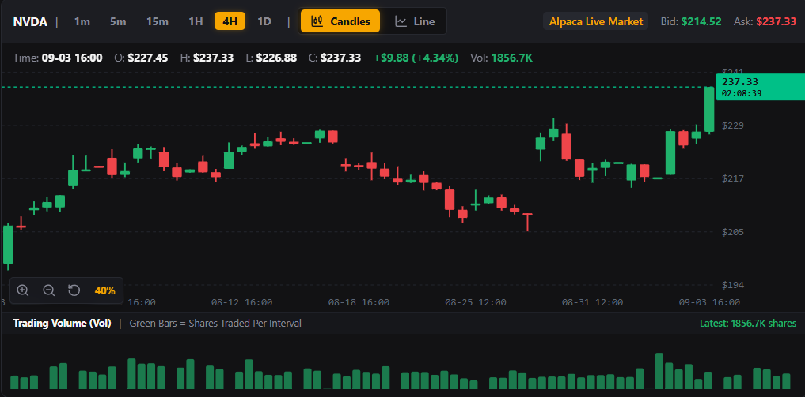

# VolHelix AI 🧬

[](https://www.python.org/downloads/)
[](https://fastapi.tiangolo.com)
[](https://nextjs.org/)
[](https://www.typescriptlang.org/)
[](https://alpaca.markets/)
[]()

> **Autonomous Institutional Options Trading Swarm with Deterministic Zero-Hallucination Risk Gate & 24/7 Position Guardian** 

---

## 📸 Executive Terminal Dashboard



---

## ⚡ Executive Summary

Traditional LLM trading bots suffer from a catastrophic vulnerability: **hallucinatory drift** and **uncontrolled capital drawdown**. When an LLM trades unconstrained, it inevitably generates high-confidence, capital-destructive decisions.

**VolHelix AI** completely re-engineers autonomous options trading by fusing:
1. **Multi-Agent Debate Swarm**: Autonomous specialization with an adversarial Devil's Advocate.
2. **Master Order Flow Confluence Gate**: Smart Money Concepts (SMC Order Blocks, Fair Value Gaps) combined with institutional Options Gamma Exposure (GEX).
3. **Deterministic Zero-LLM Risk Gate**: 10 hardcoded mathematical invariants that strictly veto LLMs.
4. **24/7 Position Guardian**: An autonomous watchdog that guarantees active positions continue to auto-close at dynamic Take-Profit and Stop-Loss levels—**even when Auto-Pilot is turned off**.
5. **Interactive 3D Derivatives & Vol Lab**: WebGL implied volatility surface with Black-Scholes inversion and Markov regime classification.

---

## 🏛️ System Architecture


---

## 🌟 Key Innovations & Breakthroughs

### 1. Master Order Flow & Gamma Confluence Gate
Instead of relying on lagging retail indicators (RSI, MACD), VolHelix AI operates on **institutional market microstructure**:
- **Bullish / Bearish Order Blocks (OB)**: Locates institutional liquidity accumulation and unmitigated zones.
- **Fair Value Gaps (FVG)**: Identifies 3-bar displacement imbalances where price is magnetized toward rebalancing.
- **Gamma Exposure Profile (GEX)**: Calculates aggregate market-maker gamma, identifying **Call Wall Resistance** ($+GEX$) and **Put Wall Support** ($-GEX$).
- **Strict Confluence Threshold**: Trades only execute if the composite setup score reaches **$\ge 70\%$**.

### 2. 24/7 Autonomous Position Guardian
In production trading, operators often pause scanning to prevent new risk. However, halting a bot normally leaves open trades unprotected.
- **VolHelix AI decouples scanning from risk management**:
- When **Auto-Pilot is ON**, the bot continuously scans the watchlist for high-confluence entries.
- When **Auto-Pilot is OFF**, scanning is paused and **zero new trades are opened**.
- **The Position Guardian continues running 24/7**: Every 5 seconds, it queries active broker positions and automatically executes market exits if an asset reaches its dynamic Take-Profit ($S \ge \text{TP}$) or Stop-Loss ($S \le \text{SL}$).

### 3. Targeted Single-Symbol Scan & Trade Isolation
Unlike standard algorithmic scanners that indiscriminately fire orders across an entire basket, VolHelix AI supports precision active-chart isolation:
- Pressing **`Scan & Trade (<Ticker>)`** evaluates **only** the currently opened stock/option chart.
- Preserves capital and gives the trader immediate diagnostic reasoning for that exact underlying without unsolicited executions across background watchlist symbols.

### 4. Dynamic Structural TP & SL Calculation
Targets are **never arbitrary percentages**. They are dynamically anchored to physical market imbalances:
- **Take-Profit (TP)**: Anchored to the nearest Fair Value Gap top or Gamma Call Wall ceiling.
- **Stop-Loss (SL)**: Anchored directly below the Order Block invalidation threshold.

### 5. Deterministic Zero-LLM Risk Gate
The Risk Gate has **ZERO LLM involvement** and cannot be overridden by prompt injection or model hallucination:
- Maximum 2.5% NAV loss per trade.
- Strict DTE constraints (7–45 days).
- Portfolio delta limits ($|\Delta| \le 150$).
- Minimum Open Interest ($> 500$) & Bid-Ask spread filters ($< \$0.35$).
- Kelly Criterion dynamic position sizing scaled by volatility regime.

### 6. Interactive 3D Derivatives & Vol Lab (`/volatility`)
- **WebGL 3D Implied Volatility Surface**: Interactive manifold plotting **Moneyness vs. DTE vs. Implied Volatility** via Black-Scholes inversion.
- **Dynamic Strike Ladders**: Automatically centers strike matrices around live spot quotes for `SPY`, `QQQ`, `AAPL`, `NVDA`, and `TSLA`.
- **HMM Regime Classifier**: 5-state Hidden Markov Model categorizing volatility into `LOW_VOL`, `NORMAL`, `ELEVATED`, `SQUEEZE`, and `CRISIS`.

### 7. Synchronized Trade Ledger & Quantitative Analytics (`/history`)
- Real-time aggregation merging SQLite `trades.db` with live Alpaca paper orders.
- Dynamic calculation of System Win Rate, Profit Factor, Gross Profit, and Payoff Ratios.
- 3-second auto-syncing with WebSocket event streaming.

### 8. Turbo Concurrent Confluence Engine & Fast Execution
- **Multi-Ticker Thread Pool Parallelization**: Watchlist symbols (`SPY`, `QQQ`, `NVDA`, `AAPL`, `TSLA`) are evaluated concurrently in parallel via a dedicated thread pool rather than sequentially, slashing full radar scan latency by over 75%.
- **Smart In-Memory TTL Caching**: High-frequency scans leverage in-memory quote and options chain caching (20s TTL), delivering sub-second response times on manual and automated cycles.
- **Dynamic Structure Expansion & FVG Mitigation**: The Confluence Gate recognizes both active Order Block retests and Fair Value Gap discount support/expansion, ensuring high-probability trades with $R:R \ge 2.0:1$ execute promptly without starvation.

---

## 💻 Tech Stack

| Layer | Technology |
|---|---|
| **Backend Framework** | FastAPI (Python 3.13), Uvicorn |
| **Broker Execution** | Alpaca Trading API, Alpaca MCP Server |
| **Agent Swarm** | LangGraph, Google Gemini Flash / Pro |
| **Quantitative Engines** | NumPy, SciPy (Black-Scholes), HMMlearn |
| **Database** | SQLite via `aiosqlite` (ACID-compliant persistence) |
| **Real-time Comms** | Socket.IO (WebSockets) |
| **Frontend Framework** | Next.js 16.3 (Turbopack, App Router, React 19) |
| **Styling & UI** | TailwindCSS, Framer Motion, Lucide Icons |
| **Visualizations** | Plotly.js (WebGL 3D Surface), Recharts, Lightweight Charts |

---

## 🚀 Quick Start Guide

### Prerequisites
- Python 3.11+ or 3.13
- Node.js 20+ & npm
- Alpaca Paper Trading API Key & Secret
- Google Gemini API Key

### 1. Environment Setup

Create `.env` in the root directory:
```env
ALPACA_API_KEY="your-alpaca-api-key"
ALPACA_API_SECRET="your-alpaca-api-secret"
ALPACA_BASE_URL="https://paper-api.alpaca.markets"
GEMINI_API_KEY="your-gemini-api-key"
DATABASE_PATH="backend/store/trades.db"
```

### 2. Backend Installation

```bash
# Windows
python -m venv env
.\env\Scripts\activate
pip install -r backend/requirements.txt

# Start FastAPI server on port 8000
python -m uvicorn backend.main:app --host 0.0.0.0 --port 8000 --reload
```

### 3. Frontend Installation

```bash
cd frontend
npm install

# Start Next.js development server on port 3000
npm run dev
```

Open [http://localhost:3000](http://localhost:3000) in your browser.

---

## 🧪 Testing & Verification

The test suite covers algorithmic pricing, Kelly position sizing, HMM regime transitions, consensus quorum, and the 24/7 Position Guardian lifecycle:

```bash
# Run backend pytest suite (47 / 47 passing)
.\env\Scripts\python.exe -m pytest backend/tests

# Run frontend linting & production build
cd frontend
npm run lint
npm run build
```

---

## 🏆 Hackathon Judges' Reference

- **Innovation Deep-Dive**: See [`INNOVATION.md`](INNOVATION.md) for full technical breakdowns of our financial engineering algorithms and multi-agent safety invariants.
- **Product Requirement Document**: Complete specifications available in [`PRD.md`](PRD.md).
- **Architecture Walkthrough**: Comprehensive verification trail in [`walkthrough.md`](walkthrough.md).

---

## 📄 License
This project is open-source under the [MIT License](LICENSE).
