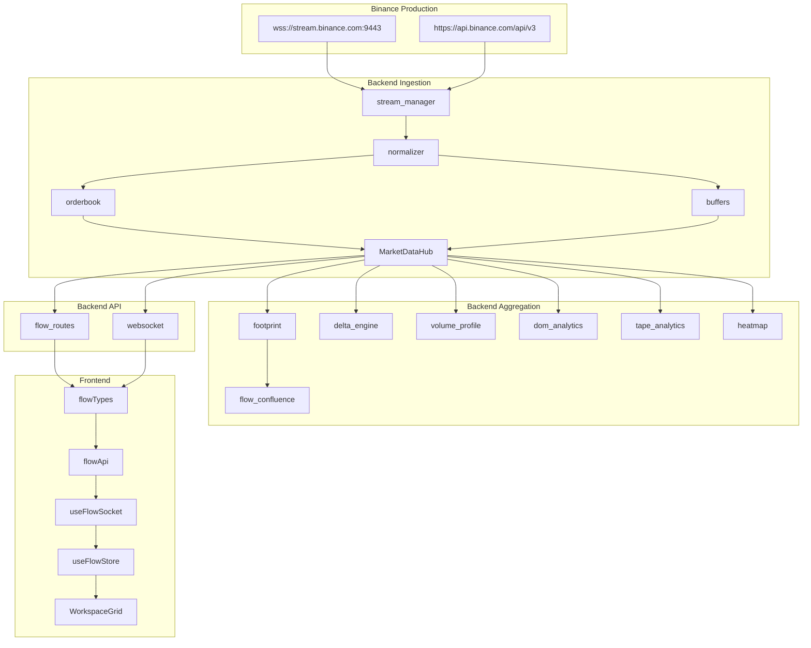

# VolHelix AI - Order Flow Terminal Architecture

## Architecture Diagram

## Data-Flow Narrative
1. **Ingestion**: The `MarketDataHub` manages websocket connections via `stream_manager`. It subscribes to `aggTrade`, `depth@100ms`, `depth20@100ms`, and `kline_1m`. Raw payloads are normalized into `Trade` and `BookDelta` objects. The `orderbook` applies diffs, while `buffers` store recent events.
2. **Aggregation**: Sub-engines (`footprint`, `delta_engine`, `volume_profile`, `dom_analytics`, `heatmap`) read from `MarketDataHub` buffers and compute derived analytics. 
3. **Confluence**: `flow_confluence.py` scores these metrics into a unified flow score, which is fed into the existing `evaluate_master_strategy_setup`.
4. **API**: `flow_routes` serve REST snapshots, and `websocket.py` broadcasts throttled updates to clients in `flow:<SYMBOL>` rooms.
5. **Frontend**: React hooks (`useFlowSocket`, `useFlowStore`) hydrate state and patch it with websocket events. Components read from this global state.

## Algorithms
- **Imbalance**: A price bucket is diagonally imbalanced if `buy_volume >= ratio * sell_volume(P-1)` or vice versa. Default ratio is 3.0.
- **Stacked Imbalance**: ≥ 3 consecutive imbalanced buckets in the same direction form an institutional interest zone.
- **Value Area (VAH/VAL)**: The price bounds containing 70% of the volume around the Point of Control (POC).
- **Absorption**: High aggressive volume that fails to move price, indicating it was absorbed by resting liquidity.
- **CVD Divergence**: When Cumulative Volume Delta is trending opposite to the price action (e.g., price rising while CVD is falling).

## Configuration Keys
- `FLOW_ENABLED`: Master switch.
- `FLOW_SYMBOLS_STR`: Comma list of streamed symbols.
- `FLOW_WS_BASE_URL`: Websocket URL.
- `FLOW_DEPTH_LEVELS`: Partial-book levels (5, 10, 20).
- `FLOW_DEPTH_SNAPSHOT_LIMIT`: Snapshot depth.
- `FLOW_USE_DIFF_DEPTH`: Diff depth processing flag.
- `FLOW_TICK_GROUP_MULTIPLIER`: Tick price bucketing size.
- `FLOW_FOOTPRINT_INTERVALS_STR`: Server-side intervals.
- `FLOW_FOOTPRINT_BARS`: Bars kept in memory.
- `FLOW_TAPE_BUFFER`: Trades retained.
- `FLOW_TRADE_BUFFER`: Raw trades retained.
- `FLOW_HEATMAP_WINDOW_SEC`: Heatmap window.
- `FLOW_HEATMAP_BIN_MS`: Heatmap bin width.
- `FLOW_IMBALANCE_RATIO`: Imbalance threshold.
- `FLOW_STACKED_IMBALANCE_MIN`: Stacked imbalance threshold.
- `FLOW_VALUE_AREA_PCT`: Value area coverage.
- `FLOW_WHALE_NOTIONAL_USD`: Whale tape threshold.
- `FLOW_WALL_MULTIPLIER`: Wall threshold.
- `FLOW_BROADCAST_HZ`: Broadcast rate.
- `FLOW_CONFLUENCE_ENABLED`: Agent confluence gate.
- `FLOW_PERSIST_BARS`: SQLite persistence.

## Panel Catalogue
1. **FootprintChart**: Price-bucketed volume.
2. **DOMLadder**: Partial depth order book with traded volume.
3. **TimeAndSales**: Tape with size/whale highlighting.
4. **LiquidityHeatmap**: Resting liquidity over time.
5. **VolumeProfile**: Session and visible range profiles.
6. **CVDPanel**: Cumulative Volume Delta line.

## Degradation Matrix
- **Binance WS down**: Graceful fallback to `DISCONNECTED` state.
- **REST Limit (429/418)**: Rate limit handled via backoff; 418 IP ban sets health to `DEGRADED`.
- **Book Desync**: Resync from REST snapshot; if failing, downgrade to partial-book stream.
- **Stale Data**: `flow_confluence` automatically hard-vetoes signals if the stream is not `LIVE`.
